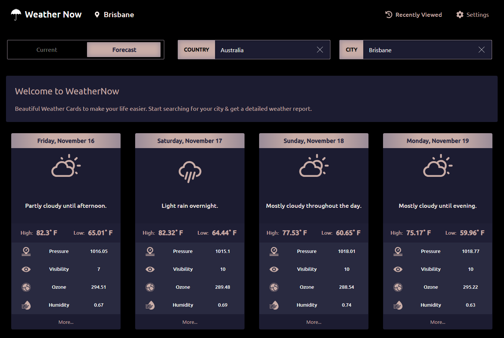

# WeatherNow

<!-- [![NPM Version][npm-image]][npm-url] -->
<!-- [![Build Status][travis-image]][travis-url] -->
<!-- [![Downloads Stats][npm-downloads]][npm-url] -->

WeatherNow is a modern weather app with very strong foundations. Powered by the Darkweather API, the app provides accurate forecast and current weather conditions in realtime.



## Development setup

The front end app is written in React and is powered by a SAILS server(a Node.js framework). Please check the server repo for setting up the SAILS server.

for installation you can either use npm or yarn.

```sh
yarn install
yarn start
```

## Release History

* 0.0.1
  * Initial Release

## Meta

Your Name – [@prabhumurthy2](https://twitter.com/prabhumurthy2) – prabhu.m.murthy@gmail.com

Distributed under the MIT license. See ``LICENSE`` for more information.

[https://github.com/prabhuignoto](https://github.com/prabhuignoto/)

## Contributing

1. Fork it (<https://github.com/yourname/yourproject/fork>)
2. Create your feature branch (`git checkout -b feature/fooBar`)
3. Commit your changes (`git commit -am 'Add some fooBar'`)
4. Push to the branch (`git push origin feature/fooBar`)
5. Create a new Pull Request

<!-- Markdown link & img dfn's -->
[wiki]: https://github.com/yourname/yourproject/wiki